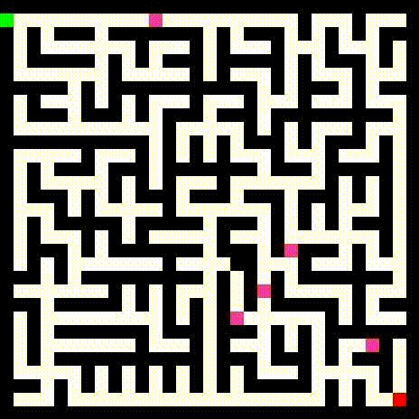

# Maze-solver

**Content:**
<ul style="list-style-type: none">
    <li><a href="#about">About us</a></li>
    <li><a href="#install">Installation</a></li>
    <li><a href="#demo">Demo</a></li>
</ul>

<h5 id="about"></h5>

## 1. About us
We will introduce briefly about our project:

+ This is our first lab (searching algorithms) for the **Fundamentals of AI** course.
+ This repo contains our implements for some algorithms: [A* search](source/level_1/A_star.py), [BFS](source/level_1/bfs.py), [DFS](source/level_1/dfs.py), [Greedy-Best first search](source/level_1/gbfs.py) and [Uniform-cost search](source/level_1/ucs.py).
+ We also proposed the [algo1](source/level_2/algo.py) and the [algo2](source/level_3/algo2.py) to solve the maze that have bonus points and pick-up points along the way.
<!-- + Check out our API documentation here [docs/api-doc/](docs/api-doc/). -->
  
<!--  -->


### Contributors:

|   Student ID   |            Name               | Profile 
|----------------|-------------------------------|----------------------------
|    20120028    |Huynh Le An | [@leanhuynh](https://github.com/leanhuynh)            
|    20120476    |Nhan Gia Kham | [@Newplayers12](https://github.com/Newplayers12)           
|    20120596    |Nguyen Bao Tin | [@nbtin](https://github.com/nbtin)

<h5 id="install"></h5>

## 2. Installation
- Linux users can execute by running the following command:
```shell
bash run.sh
```
- Windows users can execute by running the following command:
```shell
run.sh
```


<h5 id="demo"></h5>

## 3. Demo


<h5 id="normalmaze"></h5>

### 3.1. Normal maze

1. **A\* search**


2. **BFS**


3. **DFS**


4. **Uniform-cost search**


5. **Greedy-best first search**


<h5 id="bonuspointsmaze"></h5>

### 3.2. Bonus-points maze


<h5 id="pickuppointsmaze"></h5>

### 3.3. Pick-up-points maze



 